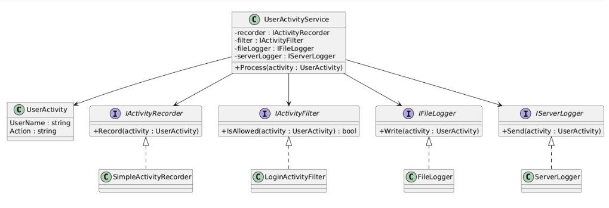

URL-діаграма

1. Поясніть принцип єдиної відповідальності (SRP). Чому він важливий для проектування?

Принцип SRP (Single Responsibility Principle) говорить: клас або модуль повинні мати лише одну причину для зміни, тобто виконувати тільки одну конкретну функцію або відповідати за одну сферу логіки.

Чому важливий:

Полегшує розуміння коду — кожен клас виконує чітку задачу.

Зменшує ризик помилок — зміни в одній функції не ламають інші.

Покращує повторне використання коду — маленькі, сфокусовані класи можна комбінувати.

Спрощує тестування — легше протестувати клас із однією відповідальністю.

Приклад:
Клас OrderProcessor відповідає тільки за обробку замовлень. Якщо в ньому є ще й логіка збереження замовлення в базі або відправки email, він порушує SRP — кожну з цих дій варто винести в окремі класи.

2. Що таке “God Object” і як він порушує SRP?

God Object — це анти-патерн, коли один клас або об’єкт контролює надто багато логіки або має занадто багато обов’язків.

Як порушує SRP:

Має кілька причин для зміни (змінюється при зміні будь-якої частини системи).

Складно розуміти, підтримувати і тестувати.

Приклади: один клас обробляє замовлення, взаємодіє з базою, робить логування, надсилає повідомлення — він став “God Object”.

3. Як декомпозиція допомагає дотримуватися SRP? Наведіть приклад.

Декомпозиція — це розбиття великого класу на менші, більш сфокусовані класи, кожен з яких виконує лише одну задачу.

Приклад:

Було: OrderProcessor робить все одразу.

Стало:

OrderProcessor — обробка логіки замовлення.

OrderRepository — збереження замовлення в базі.

EmailNotifier — надсилання повідомлень клієнту.

Тепер кожен клас має лише одну відповідальність — SRP дотримано.

4. Як діаграми класів (UML) допомагають візуалізувати та аналізувати розподіл відповідальностей?

UML-діаграми класів показують структуру системи та взаємозв’язки між класами.

Вони дозволяють побачити, які класи за що відповідають, які методи у класі, і чи клас не перевантажений логікою.

Легко виявити “God Object” або місця, де клас має більше ніж одну відповідальність.

Діаграма допомагає планувати декомпозицію ще до коду та підтримувати SRP у проекті.

Приклад:
На діаграмі видно: OrderProcessor пов’язаний з OrderRepository та EmailNotifier, а сам містить тільки методи обробки замовлень — одразу видно, що відповідальність розділена.