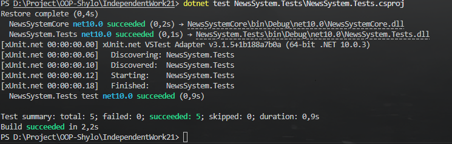

Висновок
У ході виконання самостійної роботи було реалізовано та протестовано комплексну систему обробки новин, яка базується на поєднанні чотирьох фундаментальних патернів проєктування: Singleton, Factory Method, Strategy та Observer.

Ключові результати інтеграції:
Гнучкість (Strategy + Factory): Використання Factory Method дозволило динамічно створювати об'єкти Strategy на основі вхідних параметрів. Це забезпечує легке розширення системи: додавання нового способу обробки новин (наприклад, EmailStrategy) не потребує зміни логіки в основному менеджері.

Централізація (Singleton): Патерн Singleton забезпечив єдину точку доступу до сервісів системи (NewsSystemManager), що гарантує цілісність стану та спільне використання ресурсів (фабрики та видавця подій) між різними частинами програми.

Слабке зв'язування (Observer): Завдяки подійній моделі Observer, компоненти-спостерігачі (тестові логери, сповіщувачі) отримують оновлення без прямої залежності від об'єктів-стратегій чи менеджера.

Аналіз тестування:
Проведені інтеграційні тести підтвердили стабільність системи у різних сценаріях:

Позитивні сценарії довели, що ланцюжок взаємодії "Клієнт -> Singleton -> Factory -> Strategy -> Observer" працює коректно, а дані передаються без спотворень.

Негативні та граничні сценарії (невалідні типи стратегій, порожні вхідні дані) підтвердили стійкість архітектури до помилок: система коректно генерує винятки (Exceptions) та запобігає некоректному стану об'єктів.

Ризики та рекомендації:
Основним ризиком при такій архітектурі залишається керування життєвим циклом підписок у патерні Observer. Для запобігання витокам пам'яті в реальних проєктах рекомендовано реалізувати інтерфейс IDisposable для спостерігачів або використовувати механізми автоматичного відписування.

Загалом, поєднання обраних патернів створює надійний фундамент для побудови складних систем, що відповідають принципам SOLID, зокрема принципу відкритості/закритості (OCP) та інверсії залежностей (DIP).