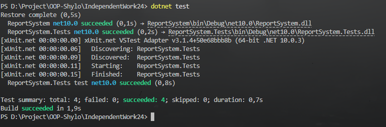

# Технічний звіт: Інтеграція структурних патернів (Самостійна робота 24)

## 1. Інтегровані патерни
У цьому рішенні інтегровано три структурні патерни для розробки системи генерації звітів:
* **Composite (`SectionNode`, `TextNode`):** Дозволяє будувати ієрархічні структури документа, однаково ставлячись до окремих абзаців та великих секцій.
* **Decorator (`HtmlTagDecorator`):** Динамічно розширює функціональність компонентів (додає HTML-теги) без створення глибокої ієрархії спадкування.
* **Proxy (`CachedReportProxy`):** Забезпечує ледаче завантаження та кешування результатів роботи (може обгортати як Leaf, так і Composite).

## 2. Результати тестування
Було розроблено та успішно пройдено 4 інтеграційні тести:
1.  **Composite Basic:** Перевіряє коректну ітерацію по дочірніх елементах `SectionNode`.
2.  **Composite + Decorator:** Доводить, що декоратор коректно обгортає результати багатокомпонентної секції (`<b>...</b>`).
3.  **Proxy Caching:** Демонструє, що при повторному виклику методу `Generate()` повертається закешований об'єкт з пам'яті, минаючи повторний обхід дерева.
4.  **Negative/Boundary Cases:** Перевіряє відмовостійкість системи. Спроба створити порожній текстовий вузол, додати `null` у Composite або обгорнути `null` Декоратором викликає очікувані винятки (`ArgumentNullException`, `ArgumentException`), захищаючи систему від падіння в рантаймі.

## 3. Оцінка продуктивності та компроміси
Порівняння "базового" (некешованого) та "проксійованого" сценаріїв виявило наступні компроміси:

* **Продуктивність (Час):** Базовий сценарій (без Proxy) має складність обходу `O(N)`, де N — кількість елементів у дереві Composite. Кожен виклик `Generate()` витрачає час на конкатенацію рядків. Використання `CachedReportProxy` знижує складність повторних викликів до `O(1)`.
* **Компроміс 1 (Пам'ять vs Процесор):** Патерн Proxy зберігає стан (`_cachedResult`), витрачаючи оперативну пам'ять на дублювання згенерованого тексту в обмін на розвантаження CPU.
* **Компроміс 2 (Керування станом):** Застосування Proxy вимагає ручного керування інвалідацією кешу (`InvalidateCache()`). Якщо в `SectionNode` додати новий елемент після першого зчитування, Proxy поверне старі (неактуальні) дані, якщо кеш не очистити.
* **Компроміс 3 (Обсяг коду):** Завдяки патерну Decorator вдалося уникнути створення класів на кшталт `BoldSectionNode` або `ItalicTextNode`. Проте це збільшує кількість об'єктів у пам'яті під час виконання.

**Практичний висновок:** Інтеграція цих патернів є високоефективною для систем з важкими операціями читання/генерації. Однак `Proxy` слід застосовувати лише на високих рівнях ієрархії (наприклад, кешувати цілий `SectionNode`, а не кожен `TextNode` окремо), щоб уникнути надмірної перевитрати пам'яті.