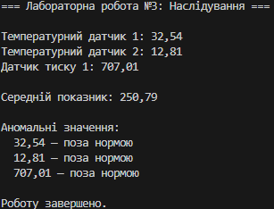

# Лабораторна робота №3. Варіант №20

**Тема:** *Наслідування: основи*  
**Мета:** *закріпити знання про базові класи, похідні класи, модифікатори доступу, використання `base`, поліморфізм у простій формі.*

## Опис виконаної роботи
- Створив клас `Sensor` з методом `ReadValue()`, який повертає показник датчика.  
- Реалізував класи `TemperatureSensor` та `PressureSensor`, які наслідують `Sensor` та перевизначають метод `ReadValue()`.  
- У головній програмі створено список датчиків різного типу, виведено інформацію про кожен датчик через метод `DisplayInfo()`.  
- Обчислено середні значення показників для кожного типу датчиків та виявлено аномальні значення (вище або нижче норми).  

## Результат роботи

## Висновки
В ході виконання лабораторної роботи було закріплено навички роботи з наслідуванням, поліморфізмом та колекціями у C#. Отримано практичний досвід:  
- створення ієрархії класів;  
- перевизначення методів у похідних класах;  
- обробки даних від різних датчиків через поліморфізм;  
- обчислення середніх значень та виявлення аномалій.

## Контрольні запитання

**1. Що таке наслідування та для чого воно використовується?**  
> Наслідування - це процес, коли клас успадковує властивості та методи іншого класу. Це дозволяє створювати більш складні структури даних, які можуть наслідувати та доповнювати функціональність вже існуючих класів.

**2. Чим відрізняється `virtual` від `abstract` методу?**  
> `virtual`-метод має реалізацію за замовчуванням і може бути перевизначений у похідних класах.  
> `abstract`-метод не має реалізації в базовому класі, його обов’язково потрібно реалізувати у похідних класах.

**3. Як працює ключове слово `base`?**  
> `base` використовується для звернення до членів базового класу (методів, властивостей, конструкторів) із похідного класу.

**4. Що таке поліморфізм часу виконання?**  
> Це здатність об’єктів похідних класів по-різному реалізовувати методи, оголошені у базовому класі, причому вибір реалізації відбувається під час виконання програми (через `override`/`virtual`/`abstract`).

**5. У чому різниця між композицією та наслідуванням?**  
> Наслідування — це відношення "є" (is-a), коли клас успадковує властивості іншого класу.  
> Композиція — це відношення "має" (has-a), коли клас містить об’єкти інших класів як свої поля. Композиція гнуч