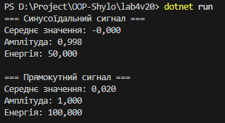

# Лабораторна робота №4  
**Варіант №20**

## Тема  
**Абстракції та інтерфейси. Композиція та агрегація**

## Мета  
Навчитися створювати абстрактні класи та інтерфейси, будувати ієрархії класів із використанням композиції та агрегації, реалізовувати прості обчислення, демонструвати гнучкість і повторне використання коду.

---

## Опис виконаної роботи

- Створено інтерфейс `ISignal`, який задає структуру для будь-якого типу сигналів.
- Реалізовано абстрактний клас `SignalBase`, що містить спільні властивості — амплітуду, частоту та тривалість сигналу.
- Створено два класи:
  - `SineSignal` — синусоїдальний сигнал
  - `SquareSignal` — прямокутний сигнал  
  Обидва реалізують інтерфейс `ISignal` і наслідують `SignalBase`.
- Використано композицію у класі `SignalAnalyzer`, який аналізує будь-який сигнал (через інтерфейс `ISignal`) та обчислює його середнє значення, амплітуду та енергію.
- У головній програмі створено об’єкти різних типів сигналів, виконано обчислення й виведено результати у консоль.

---

## Результат роботи

---

## Висновки

У ході виконання лабораторної роботи було засвоєно принципи об’єктно-орієнтованого програмування на C#:

- Створення інтерфейсів і абстрактних класів
- Побудова гнучких ієрархій класів
- Використання композиції для аналізу об’єктів
- Розробка розширюваних і зрозумілих програмних структур

---

## Контрольні запитання

**1. У чому різниця між абстрактним класом і інтерфейсом?**  
Абстрактний клас може містити як реалізовані, так і нереалізовані методи, а інтерфейс — лише сигнатури методів. Клас може реалізовувати кілька інтерфейсів, але лише один базовий клас.

**2. Коли краще використовувати композицію, а коли наслідування?**  
Наслідування застосовується, коли один клас є різновидом іншого (зв’язок “є”), а композиція — коли клас містить інший як частину (зв’язок “має”).

**3. Як працює агрегація та чим вона відрізняється від композиції?**  
Агрегація — це слабке відношення, коли об’єкти можуть існувати незалежно. У композиції ж об’єкт-компонент знищується разом із головним об’єктом.

**4. Чи може клас реалізовувати кілька інтерфейсів одночасно?**  
Так, клас у C# може реалізовувати кілька інтерфейсів, що дозволяє будувати гнучкі структури без множинного наслідування.

**5. Для чого в ООП використовують інтерфейси як контракти?**  
Інтерфейси визначають набір методів, які клас зобов’язаний реалізувати. Це забезпечує узгодженість, зменшує залежність між частинами програми та спрощує тестування.